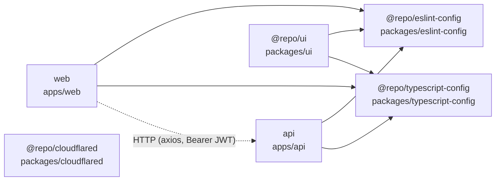
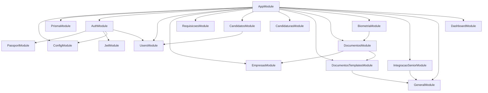
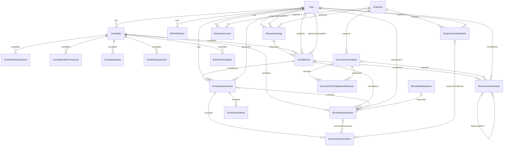

# Grafo do Codebase — admissaodigital

_Gerado em 24/07/2026 por `scripts/graphify.mjs`._

## Visão geral do workspace

## apps/api — módulos NestJS

| Módulo | Controllers | Services |
| --- | --- | --- |
| `AppModule` | 1 | 1 |
| `AuthModule` | 1 | 4 |
| `BiometriaModule` | 1 | 1 |
| `CandidatosModule` | 1 | 1 |
| `CandidaturasModule` | 1 | 1 |
| `DashboardModule` | 1 | 1 |
| `DocumentosModule` | 4 | 8 |
| `DocumentosTemplatesModule` | 1 | 1 |
| `EmpresasModule` | 2 | 2 |
| `GeneralModule` | 1 | 2 |
| `IntegracaoSeniorModule` | 1 | 1 |
| `PrismaModule` | 0 | 1 |
| `RequisicoesModule` | 1 | 1 |
| `UsersModule` | 1 | 1 |

## apps/web — rotas

```mermaid
graph TD
  Router["router.tsx"]
  Router --> R0["Navigate<br/>/login"]
  Router --> R1["CompanyRequiredRoute<br/>/empresa-obrigatoria"]
  Router --> R2["HomePage<br/>/"]
  Router --> R3["RequisicoesPage<br/>/requisicoes"]
  Router --> R4["RequisicaoFormPage<br/>/requisicoes/novo"]
  Router --> R5["RequisicaoFormPage<br/>/requisicoes/:id"]
  Router --> R6["RequisicaoFormPage<br/>/requisicoes/:id/editar"]
  Router --> R7["CandidatosPage<br/>/candidatos"]
  Router --> R8["CandidatoFormPage<br/>/candidatos/novo"]
  Router --> R9["CandidatoFormPage<br/>/candidatos/:id"]
  Router --> R10["CandidatoFormPage<br/>/candidatos/:id/editar"]
  Router --> R11["DocumentosRhPage<br/>/candidatos/:id/documentos"]
  Router --> R12["DocumentosRhPage<br/>/documentos"]
  Router --> R13["AssinaturasPendentesPage<br/>/assinaturas"]
  Router --> R14["AssinaturasRhPage<br/>/assinaturas/:candidatoId"]
  Router --> R15["CertificadosA1Page<br/>/certificados-a1"]
  Router --> R16["DocumentoTemplatesPage<br/>/documentos/configuracoes"]
  Router --> R17["EmpresasPage<br/>/empresas"]
  Router --> R18["UsuariosPage<br/>/usuarios"]
  Router --> R19["BiometriaPage<br/>/biometria"]
  Router --> R20["HomePage<br/>/candidato"]
  Router --> R21["CandidateDocumentosPage<br/>/candidato/documentos"]
  Router --> R22["CandidateAssinaturasPage<br/>/candidato/assinaturas"]
  Router --> R23["RegulamentoPage<br/>/candidato/regulamento"]
  Router --> R24["HomePage<br/>/candidato/status"]
  Router --> R25["VerificacaoPage<br/>/verificar/:codigo?"]
  Router --> R26["Navigate<br/>*"]
```

Guards de rota: `ProtectedRoute`, `AdminRoute`, `AdminLayoutRoute`, `CandidateLayoutRoute`, `CompanyRequiredRoute`, `CompleteProfileRoute`, `PublicRoute`.

## Entidades de dados (Prisma)

Standalone (sem FK): `CodeOtp`, `IntegrationClient`.

## Serviços externos

| Serviço | Uso | Onde |
| --- | --- | --- |
| PostgreSQL | Banco principal (Prisma) | `apps/api/prisma/schema.prisma` |
| SMTP (nodemailer) | Envio de OTP por e-mail | `apps/api/src/auth/email.service.ts` |
| AWS SNS | Envio de OTP por SMS | `apps/api/src/auth/sms.service.ts` |
| Google (service account) | OCR de documentos | `apps/api/src/documentos/ocr.service.ts` |
| Assinatura digital A1 | Assinatura de PDFs com certificado da empresa | `apps/api/src/documentos/pdf-digital-signature.service.ts` |
| AWS S3 | Armazenamento de documentos | `apps/api/src/documentos/s3-storage.service.ts` |
| ERP Sênior | Integração de admissão e dados de RH | `apps/api/src/general/senior-api.service.ts`, `apps/api/src/integracao-senior/gerar-admissao.dto.ts`, `apps/api/src/integracao-senior/integracao-senior.controller.ts`, … |
